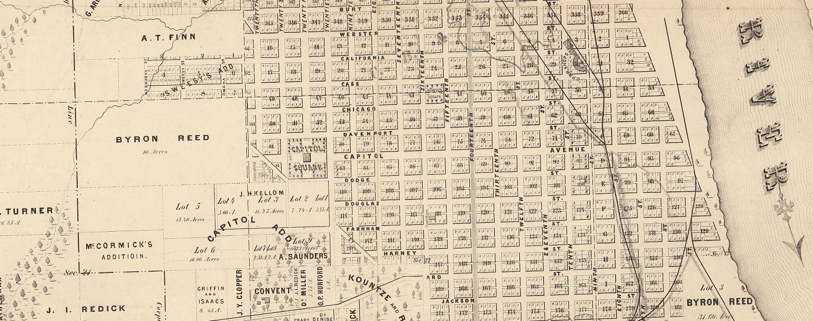

---
layout: page
order: 1
title: Course Description
...

What is digital humanities and what does it offer the humanities? We will investigate how digital humanities can enrich the study of humanistic topics by looking at activities, tools, platforms, and projects. We also will explore the historical underpinnings behind knowledge production on which digital practice depend. We will focus on resources enabling new forms of scholarship, looking at tools for visualization and text analysis for generating historical interpretations, and explore alternative forms of publishing, design, and research. The course covers a range of readings along with a critical engagement with tools and resources that enable new methods for print scholarship and the possibilities of new forms of scholarship. To aid our efforts, we will focus our attention on American environmental history.

In this course, you will:

- **create historical scholarship using digital tools and resources**: you'll spend time learning how to design computational approaches to social questions. How do you create or find data that is useful for your questions? What tools work best for describing this data? You'll learn how to do this for your own projects and through exposure to a variety of scholars who work on these issues day-to-day.
- **improve your ability to read data and primary sources**: other humanities and social science courses have probably taught you how to read a variety of textual and material objects (speeches, articles, and so on). In this course we'll be focusing on those objects while also improving your ability to read data and integrate these readings with real world data.

## Learning goals

1. Thoughtfully and purposefully engage in dialog about history on the public web with a range of stakeholders in digital history: historians, archivists, museum professionals, educators, and amateurs.
2. Discover, evaluate, and implement digital tools and resources to support emerging and traditional forms of scholarship, public projects, and teaching.
3. Develop proposals for digital history resources with detailed plans for project management, design, outreach, and evaluation.
4. Understand and articulate the key issues in collecting, preserving, and interpreting digital and digitized primary sources from the perspective of a historian.

## Required readings

No extra textbook is required. All of the readings will be online or made available on Canvas. Consult the [schedule](http://jasonheppler.org/courses/dh.2018s/schedule/).
